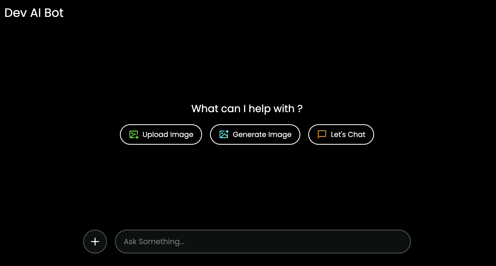
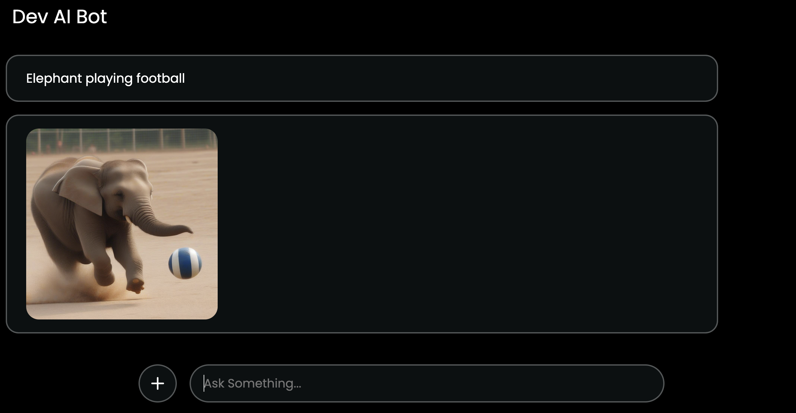
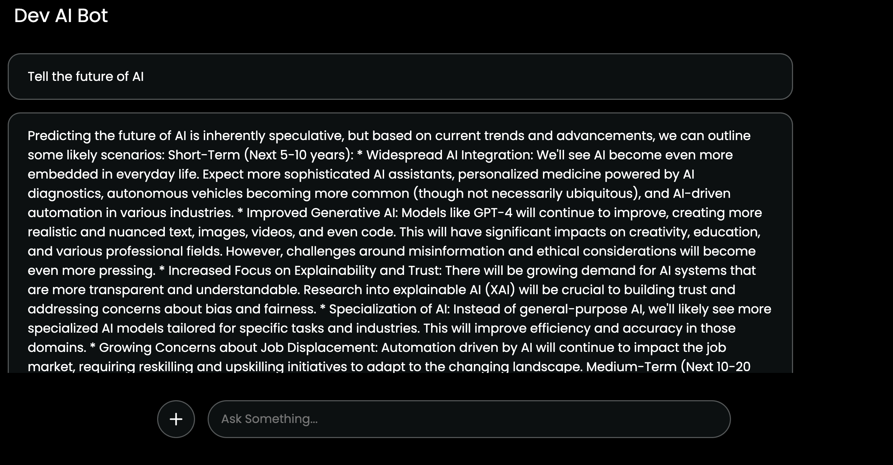

# DEV AI Bot 🤖  

An advanced DEV-AI-powered chatbot built with **React Vite** and Tailwind which is fully responsive, capable of:  

✅ Chatting with users in a natural and intelligent way  
✅ Generating images from text prompts  
✅ Understanding and analyzing uploaded images  

This AI bot leverages **Gemini API** and **Hugging Face API** to provide accurate and powerful AI responses.  

## 🚀 Live Demo  
[🔗 AI Bot Deployment](https://dev-ai-bot.netlify.app/)  

## 🛠️ Features  
- **Chat with AI** – Engage in conversations with an intelligent chatbot  
- **Text-to-Image Generation** – Convert text prompts into AI-generated images  
- **Image Understanding** – Upload images and let the AI analyze them  
- **High Accuracy** – Uses cutting-edge AI models for reliable outputs  

## 📦 Tech Stack  
- **Frontend:** React (Vite)  
- **APIs Used:**  
  - [Gemini API](https://ai.google.dev/) (for chatbot and image understanding)  
  - [Hugging Face API](https://huggingface.co/) (for text-to-image generation)  

## 🏗️ Setup & Installation  

1. **Clone the Repository**  
   ```sh
   git clone
   cd Dev-ai-bot
## Install Dependencies


## Create a .env file in the root directory and add your API keys:
VITE_GEMINI_API_KEY=your_gemini_api_key
VITE_HUGGING_FACE_API_KEY=your_hugging_face_api_key


## 📸 Screenshots  
Here are some screenshots of the AI bot in action:  

### Home Feature  
  

### Text-to-Image Generation  
  

### Text Understanding and Answering
  


## Made with ❤️ by Devansh